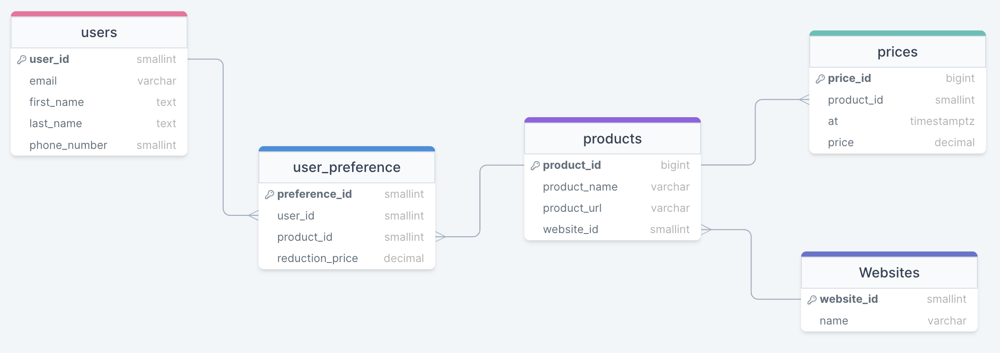

# Sales Tracker

## Cloud Architecture

### How it works

### Pipeline

### Storage

### Emailing Service

### Dashboard

## Entity Relationship Diagram (ERD)

An ERD which clearly describes the tables in the schema and the data stored in each table:

### Users Table

This table will be where the users personal information will be uploaded to. This includes their email, first and last name, and phone number. The email and phone number are essential fields that are required depending on whether the user wants to be notified by email or text message. 

### User Preference Table

This table is filled in last as it depends on the product id and user id, whilst inserting the users preference for the price reduction they want to be notified at.

### Products Table

This table contains the information necessary for the product when initially uploaded to the database. This includes the product id, product name, url and website id of the product. This table also depends on the prices table. If a product is not in the table then a new row will be created within the table. 

### Prices Table

This table will be continuously updated and will contain the price of each product over time. This table refers to the product id whilst including the price, and the time the price was recorded.

### Websites Table

This table stores the different websites to be tracked. This allows users to easily see the different websites they can use to track products.

