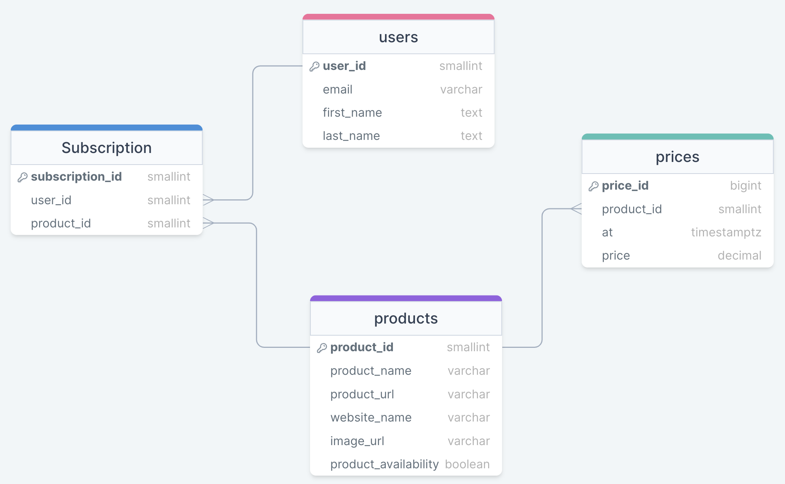

# 

Welcome to the Sales Tracker Repository!

Ever lost out on buying a product because you wanted to wait until it was on sale, and then the product sold out before you had a chance to buy it? Well with this repo that problem can disappear! All you have to do is subscribe to a product you want to track and be prepared to check your emails for when it goes on sale! It's as simple as that. 

### Installation Tips

- It is recommended before stating any installations that you make a new virtual environment. 
  - To make a new virtual environment, **Please go to the folder you want to create a virtual environment in**:
    - `python3 -m venv venv`
    - `source ./venv/bin/activate`

- A new environment will be required for each folder in this repository.

## Cloud Architecture
A high level overview of the cloud architecture can be seen below:

### How it works

#### Pipeline
This pipeline acts as more of a web scraper that extracts data from an api and different web pages. This is then loaded into a database (see [Storage](#Storage)). This is triggered every time a user makes a POST request to the API (i.e. adding a product/deleting a subscription).

#### Storage
 This is a PostgreSQL server with an RDS database. 

#### Emailing Service

There are many emailing services throughout this project:

1. New User Sign up 
    - A user will receive an email via SES when they are initially added to the product system asking them to verify their identity. Only after the user verifies their identity will they be able to receive the following emails. 

2. Price drop email 
    - A user will receive an email via SES when a product they are subscribed to has dropped in price (i.e. gone on sale). The user will receive this email within 3 minutes of the price dropping in order to maximize the chances of successful user purchase. 

3. Product no longer available
    - A user will receive an email via SES when a product they are subscribed to no longer exists. This means the product has been taken off the website entirely and the url is invalid.

4. Product sold out. 
    - A user will receive an email via SES when a product they are subscribe to is sold out. This means the product is still on the website and has a valid url not the product availability is none.

#### Dashboard

For this project, a dashboard is provided using Streamlit. The dashboard here is run as a service within an ECS cluster. The dashboard will read from the RDS so that it can obtain real-time data and it will also read from an S3 bucket to obtain historical data as well.

The Dashboard contains two interfaces:
  - Admin Dashboard
    - Shows information that only the admin is allowed to see.
  - User Dashboard
    - All users have the same dashboard but catered to their products.

## Entity Relationship Diagram (ERD)

An ERD which clearly describes the tables in the schema and the data stored in each table:

#### Users Table

This table will be where the users personal information will be uploaded to. This includes their email, first and last name. 

#### User Preference Table

This table is filled in last as it depends on the product id and user id, whilst inserting the users preference for the price reduction they want to be notified at.

#### Products Table

This table contains the information necessary for the product when initially uploaded to the database. This includes the product id, product name, url and website id of the product. This table also depends on the prices table. If a product is not in the table then a new row will be created within the table. 

#### Prices Table

This table will be updated when a price change is made and will contain the price of each product over time. This table refers to the product id whilst including the price, and the time the price was recorded.

#### Websites Table

This table stores the different websites to be tracked. This allows users to easily see the different websites they can use to track products.

## Files explained
Within each folder, there is a README that explains specifically its role. But to give a high level overview:

- `dashboard` - contains code related to the dashboarding service.
- `diagrams` - contains all of the diagrams required for all README files.
- `pipeline` - contains the code that extracts information from various websites / APIs and the uploads it to an RDS.
- `price-alerts-and-updates` - contains code related to sending a user an email depending on when if a price has dropped or if a products availability has changed.
- `terraform` - contains terraform files that setup most of the cloud infrastructure needed.
