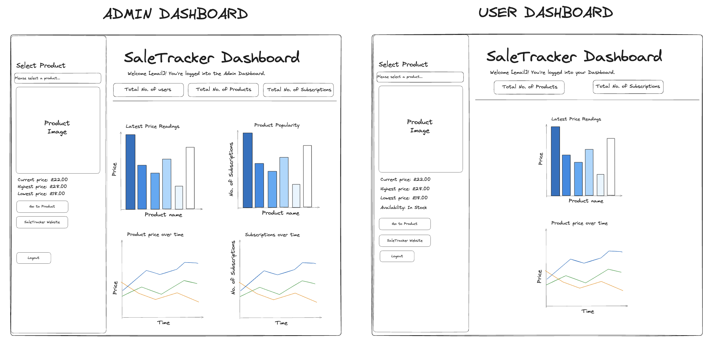

# 📈 Dashboard

This folder should contain all code and resources required to run the Dashboard for the SaleTracker.\
The files in this folder are used extract information from the RDS database and render useful information from the extraction for users to visualise.

## ⚙️ Installation and Requirements

- It is recommended before stating any installations that you make a new virtual environment. 
- A new environment will be required for each folder in this repository.

- Install all requirements for this folder: `pip3 install -r requirements.txt`
- Install type hints for boto3: `python -m pip install 'boto3-stubs[ses]'`

- Create a `.env` file with `touch .env`

### Required env variables

`- DB_USER` : The user name to login to the database.
`- DB_PASSWORD` : The password to login to the database.
`- DB_PORT` : The port you are using.
`- DB_HOST` : The host name or address of a database server.
`- DB_NAME` : The name of your database.

### Running the Dashboard 

In order to run the Dashboard locally : `streamlit run app.py`. 

As a user, in order to log in please use the **email address you subscribed to a product with**.\
Your password will be: `userPassword`

In order to run the Dashboard on the cloud please follow the setup instructions when creating an ECR, run the ECS task and then use the public IP address with :8501 (default streamlit port) at the end for the Dashboard to run on the cloud. 

## 🗂️ Files 

- `requirements.txt` : This file contains all the required packages to run any other files
- `Dockerfile` : This file contains instructions to create a new docker image that runs `app.py`.
- `extract.py` : Contains code that scrapes required information from the url given in a POST request.
- `app.py` : Contains code needed to run the Dashboard and login as a user/admin.
- `cookies.py` : Contains code required to create cookies for a session on the dashboard.
- `database.py` : Makes a connection to the remote database and joins tables via an sql query. 
- `rendering.py` : Formats the user/admin dashboard and displays visualisations.
- `visualisations.py` : Contains graphs to be plotted in streamlit. 
- `test_dash_app.py` : Contains unit tests for code needed to run the dashboard.
- `dockerise_and_upload.sh` : Contains the shell script commands required to dockerise and upload the dashboard to the cloud. 

Folders:

- `.streamlit` :
    - `config.toml` : A configuration file required to set the streamlit theme. 

## 📊 Wireframe

